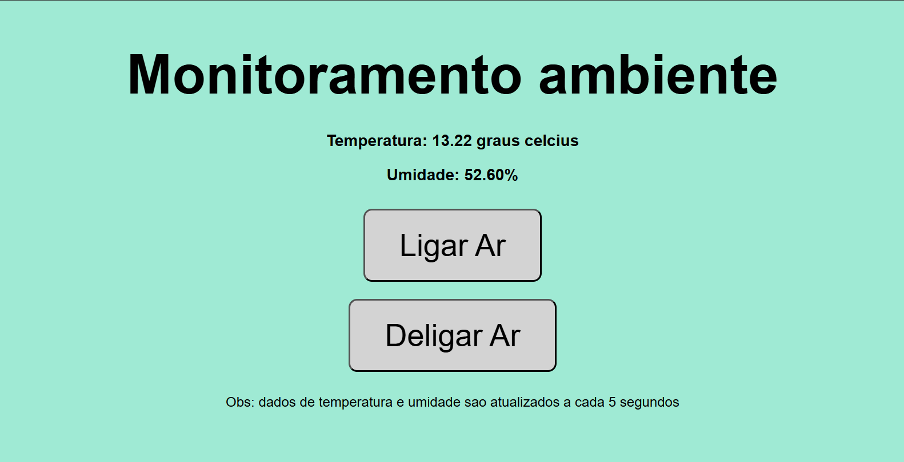

# Título do Projeto

Monitoramento de Ambiente

## Objetivo Geral  

O objetivo do projeto é monitorar um ambiente, permitindo a verificação da temperatura e da umidade em tempo real por um site na **WEB**. Além disso, possibilita o acionamento de um ar-condicionado de forma remota, caso o usuário considere necessário.

## Descrição Funcional  
O projeto utiliza o módulo WiFi para a criação de servidor **WEB** capaz de mostrar um site **HTML** simples. Este site é responsável por mostrar de forma remota os dados lidos pelo sistema.

O sistema faz a leitura de dois sensores (simulados pelos **potenciômetros**), um de temperatura e outro de umidade, para verificar como está um determinado ambiente.

Não necessariamente precisa ser uma sala, quarto, cozinha, ou casa pessoal. Pode estar presente em uma sala de máquina, em um escritório ou outros ambientes que precisam de controle de temperatura e umidade.
Juntamente com os dados, o sistema pode ativar um ar-condicionado ou outro dispositivo (fica a critério do usuário) que esteja na sala, de forma remota ao apertar um botão presente no site.

O botão ativa, de forma simulada, um **LED** que informa que o dispositivo foi ativado. Para o sistema real, o pino ligado ao **LED** estará conectado a um relé capaz de fazer a ligação com o dispositivo de desejo ( seja ar-condicionado ou outro dispositivo).

> A seguir é possível observar a interface do site.
> 
> Figura 1: Interface do sistema **WEB**.

Além das funcionalidades remotas que o projeto oferece, localmente o sistema utiliza uma interface para indicar que o sistema está funcionando, fazendo uso de um ***Display OLED***.

## Uso dos Periféricos da BitDogLab

Os periféricos utilizados para esse projeto foram: 2 **potenciômetros**, conectados ao ***joystick*** presente na placa; **LED RGB**; ***Display OLED***; e o módulo **WiFi**.

Os potenciômetros foram utilizados exclusivamente para simular os sensores de temperatura e umidade, podendo ser variados ao movimentar o ***joystick***. É interessante pontuar que o sensor de temperatura usado como base foi o **LM35** que tem 10mV/°C de resolução. Visto isto, foi adicionado um shift nos valores, para que a posição inicial do ***joystick*** apresente valores mais reais de temperatura.

O **LED RGB** foi usado como alternativa para simular o dispositivo que será incorporado ao sistema, seja ele um ar-condicionado, ventilador ou outro, de acordo com a necessidade.

Já o ***Display OLED*** foi utilizado para apresentar informações do sistema de forma local, para fins de depuração do sistema. Coisas como informações de conexão **WiFi**, criação do servidor e também recebimento de requisições.

Por fim, o módulo **WiFi** foi utilizado para basicamente se conectar a uma rede local e subir um servidor **WEB** local capaz de receber requisições. A partir das requisições, é retornado um HTML, que gera a página **WEB**.

## Melhorias futuras

Para melhorias possíveis em novas atualizações, temos alguns pontos para melhorar.

Primeiramente, uma melhoria interessante que será feita é a adesão de uma verificação de temperatura e de ligação automática do dispositivo, sem precisar o usuário fazer essa ligação manualmente pelo site.

Outra melhoria é a verificação do estado do dispositivo, pois caso aconteça algum erro na ligação e o dispositivo não estiver ativo, o usuário remoto não tem nenhuma indicação de que o dispositivo está ligado.

Por fim, é interessante remover um dos botões e colocar apenas um, a fim de colocar um botão que mude o nome para os cenários de dispositivo ligado e desligado.

## Observações de Uso

Para utilização do projeto, faça a aquisição do código no repositório do ***GitHub***, e utilizando a extensão do Pico **SDK** crie o projeto a partir do ``CMakeLists.txt``.

É necessário a criação de um arquivo na raiz, com nome de ``credenciais.h`` contendo as credenciais de **WiFi**  de sua rede local, da seguinte forma:

````
#define WIFI_SSID "NOME"
#define WIFI_PASSWORD "SENHA"
````

Basta fazer essas configurações para ser possível fazer a execução do projeto localmente.

## Links para acesso ao código e ao vídeo.  

[Link do video ensaio]()