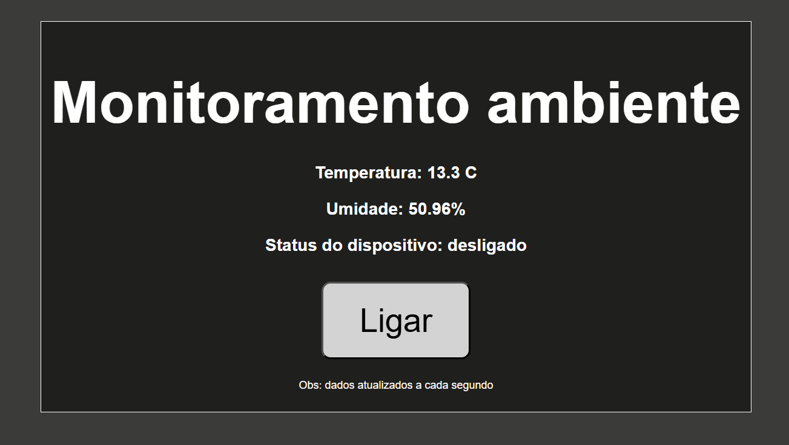

# Título do Projeto

Monitoramento de Ambiente

## Objetivo Geral  

O objetivo do projeto é monitorar um ambiente, permitindo a verificação da temperatura e da umidade em tempo real por um site na **WEB**. Além disso, possibilita o acionamento de um ar-condicionado de forma remota, caso o usuário considere necessário.

## Descrição Funcional  
O projeto utiliza o módulo WiFi para a criação de servidor **WEB** capaz de mostrar um site **HTML** simples. Este site é responsável por mostrar de forma remota os dados lidos pelo sistema.

O sistema faz a leitura de dois sensores (simulados pelos **potenciômetros**), um de temperatura e outro de umidade, para verificar como está um determinado ambiente.

Não necessariamente precisa ser uma sala, quarto, cozinha, ou casa pessoal. Pode estar presente em uma sala de máquina, em um escritório ou outros ambientes que precisam de controle de temperatura e umidade.

Juntamente com os dados, o sistema pode ativar ou desativar um ar-condicionado ou outro dispositivo (fica a critério do usuário) que esteja na sala, de forma remota ao apertar um botão presente no site. Esse dispositivo, além de controlado pelo site, pode ser desativado ou ativado automaticamente caso os níveis de temperatura cheguem em um determinado limiar. No caso desse projeto, os limiares foram 0°C e 50°C.

O botão manipula um **LED** que informa se o dispositivo foi ativado/desativado. Para o sistema real, o pino ligado ao **LED** estará conectado a um relé capaz de fazer a ligação com o dispositivo de desejo ( seja ar-condicionado ou outro dispositivo).

> A seguir é possível observar a interface do site.
> 
> Figura 1: Interface do sistema **WEB**.

Além das funcionalidades remotas que o projeto oferece, localmente o sistema utiliza uma interface para indicar que o sistema está funcionando, fazendo uso de um ***Display OLED***.

## Uso dos Periféricos da BitDogLab

Os periféricos utilizados para esse projeto foram: 2 **potenciômetros**, conectados ao ***joystick*** presente na placa; **LED RGB(cor azul)**; ***Display OLED***; e o módulo **WiFi**.

Os potenciômetros foram utilizados exclusivamente para simular os sensores de temperatura e umidade, podendo ser variados ao movimentar o ***joystick***. É interessante pontuar que o sensor de temperatura usado como base foi o **LM35** que tem 10mV/°C de resolução. Visto isto, foi adicionado um shift nos valores, para que a posição inicial do ***joystick*** apresente valores mais reais de temperatura.

O **LED RGB(cor azul)** foi usado como alternativa para simular o dispositivo que será incorporado ao sistema, seja ele um ar-condicionado, ventilador ou outro, de acordo com a necessidade.

Já o ***Display OLED*** foi utilizado para apresentar informações do sistema de forma local, para fins de depuração do sistema. Coisas como informações de conexão **WiFi**, criação do servidor e também recebimento de requisições.

Por fim, o módulo **WiFi** foi utilizado para basicamente se conectar a uma rede local e subir um servidor **WEB** local capaz de receber requisições. A partir das requisições, é retornado um HTML, que gera a página **WEB**.

## Melhorias

O projeto apresentou algumas melhorias com relação à versão anterior do ***webserver***, tanto com relação a *bugs*, quanto a novas funcionalidades e  aparência.

A primeira mudança que pode ser notada é na aparência do site, como é mostrado na **figura 1**. Essa figura apresenta o site já com as modificações, tanto de cores e design, como também de informação, como pode ser visto no novo dado, o status do dispositivo.

Além disso, um dos botões foram removidos, para que o controle do dispositivo fique mais dinâmico, ativando e desativando pelo mesmo botão.

Outros pontos de melhoria foram a correção de *bugs*. O site apresentava *bugs* de carregamento, que acarretavam muitas vezes em mau funcionamento da página, não carregando todas as informações. Esses *bugs* estavam acontecendo por conta de algumas configurações que estavam incorretas na biblioteca `lwipopts.h`. Acrescentando algumas linhas, como tamanho de ***buffer*** de recebimento e de envio, os *bugs* cessaram.

Ainda com relação ao carregamento, foram adicionadas algumas rotas que retornavam apenas dados em ***json***, para fazer a alimentação do **HTML**, tirando a necessidade da página ser recarregada por completo para os dados carregarem continuamente. Essas rotas são: `/data` e `/device`.

- `/data`: faz a captura dos dados por completo, retornando temperatura, umidade e o status do dispositivo.
- `/device`: desativa/ativa o dispositivo e retorna o status dele (true para ativo e false para inativo)

Essas rotas são chamadas usando a função `fetch`  do **javascript**.

Por fim, foi adicionada uma melhoria no dispositivo localmente, fazendo com que ele verifique os níveis de temperatura para caso a temperatura chegue a valores limites (para esse projeto, 0°C no limite inferior e 50°C no limite superior), o dispositivo de controle térmico seja acionado ou desligado, a depender do limiar que foi atingido.

## Observações de Uso

Para utilização do projeto, faça a aquisição do código no repositório do ***GitHub***, e utilizando a extensão do Pico **SDK** crie o projeto a partir do ``CMakeLists.txt``.

Foi adicionado um arquivo, `index.html`, contendo o **HTML** que é apresentado no ***webserver***. Caso queira visualizar, mude as **URLs** na tag `<script>` de acordo com o IP do seu ***Raspberry Pi Pico W*** e abra usando um navegador. O comportamento será o mesmo do site presente no ***webserver***.

É necessário a criação de um arquivo na raiz, com nome de ``credenciais.h`` contendo as credenciais de **WiFi**  de sua rede local, da seguinte forma:

````
#define WIFI_SSID "NOME"
#define WIFI_PASSWORD "SENHA"
````

Basta fazer essas configurações para ser possível fazer a execução do projeto localmente.

## Links para acesso ao código e ao vídeo.  

[Link do video ensaio (pt. 1)](https://youtu.be/tgz7Ovx1x6Q)
[Link do video ensaio (pt. 2)](https://youtu.be/2DiaiYl-e5Q)